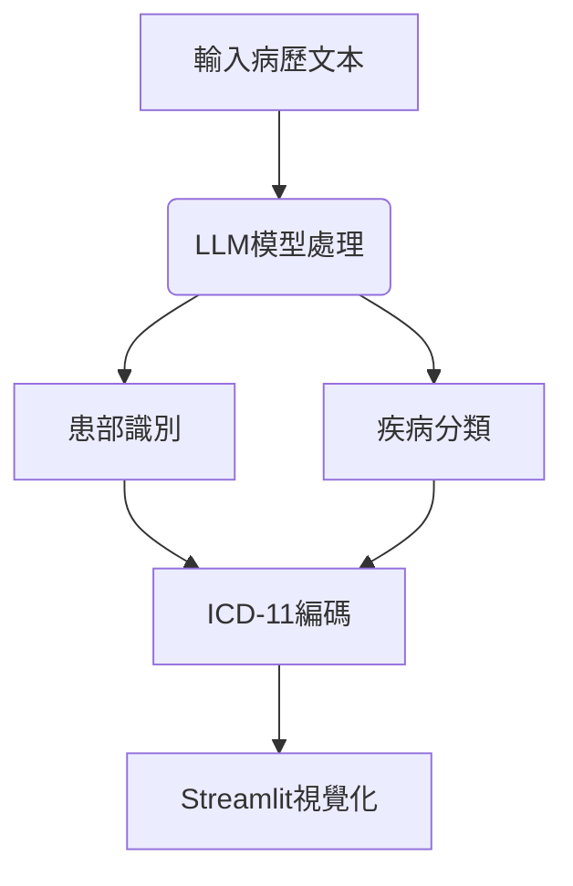

以下是使用PyTorch開發基於LLM的ICD-11編碼系統，並整合Streamlit進行視覺化展示的完整解決方案：

---

## 一、系統架構設計


---

## 二、核心代碼實現

### 1. 數據預處理 (data_preprocessor.py)
```python
import pandas as pd
from sklearn.model_selection import train_test_split

def load_data(path):
    data = pd.read_csv(path)
    data['combined_text'] = data['symptoms'] + " " + data['diagnosis_notes']
    return data

def preprocess_icd_labels(data):
    # 轉換ICD-11多層級編碼
    data['icd_hierarchy'] = data['icd11_code'].apply(
        lambda x: [x[:3], x[3:6], x[6:]]
    )
    return data

# 示例數據結構
# | symptoms | diagnosis_notes | body_part | disease_type | icd11_code |
```

### 2. 多任務模型設計 (model.py)
```python
import torch
from transformers import BertModel, BertPreTrainedModel

class MedicalBERT(BertPreTrainedModel):
    def __init__(self, config):
        super().__init__(config)
        self.bert = BertModel(config)
        # 患部分類頭
        self.body_part_head = torch.nn.Linear(config.hidden_size, 32)
        # 疾病分類頭
        self.disease_head = torch.nn.Linear(config.hidden_size, 128)
        # ICD編碼多層級分類
        self.icd_level1 = torch.nn.Linear(config.hidden_size, 27)  # 26章+1
        self.icd_level2 = torch.nn.Linear(config.hidden_size, 300)
        self.icd_level3 = torch.nn.Linear(config.hidden_size, 2000)

    def forward(self, input_ids, attention_mask):
        outputs = self.bert(input_ids, attention_mask=attention_mask)
        pooled_output = outputs.pooler_output
        
        body_logits = self.body_part_head(pooled_output)
        disease_logits = self.disease_head(pooled_output)
        icd1 = self.icd_level1(pooled_output)
        icd2 = self.icd_level2(pooled_output)
        icd3 = self.icd_level3(pooled_output)
        
        return {
            'body': body_logits,
            'disease': disease_logits,
            'icd1': icd1,
            'icd2': icd2,
            'icd3': icd3
        }
```

### 3. 訓練流程 (train.py)
```python
from transformers import BertTokenizer, AdamW
from torch.utils.data import Dataset, DataLoader

class MedicalDataset(Dataset):
    def __init__(self, texts, body_labels, disease_labels, icd_labels):
        self.tokenizer = BertTokenizer.from_pretrained('emilyalsentzer/Bio_ClinicalBERT')
        self.texts = texts
        self.body_labels = body_labels
        self.disease_labels = disease_labels
        self.icd_labels = icd_labels

    def __getitem__(self, idx):
        encoding = self.tokenizer(
            self.texts[idx],
            max_length=256,
            padding='max_length',
            truncation=True,
            return_tensors='pt'
        )
        return {
            'input_ids': encoding['input_ids'].flatten(),
            'attention_mask': encoding['attention_mask'].flatten(),
            'body_labels': torch.tensor(self.body_labels[idx], dtype=torch.long),
            'disease_labels': torch.tensor(self.disease_labels[idx], dtype=torch.long),
            'icd_labels': torch.tensor(self.icd_labels[idx], dtype=torch.long)
        }

def train_model():
    # 初始化模型
    model = MedicalBERT.from_pretrained('emilyalsentzer/Bio_ClinicalBERT')
    optimizer = AdamW(model.parameters(), lr=2e-5)
    
    # 多任務損失權重
    loss_weights = {'body': 0.3, 'disease': 0.3, 'icd': 0.4}
    
    for epoch in range(10):
        for batch in train_loader:
            outputs = model(batch['input_ids'], batch['attention_mask'])
            
            # 計算多任務損失
            loss_body = torch.nn.CrossEntropyLoss()(
                outputs['body'], batch['body_labels'])
            loss_disease = torch.nn.CrossEntropyLoss()(
                outputs['disease'], batch['disease_labels'])
            loss_icd = sum([
                torch.nn.CrossEntropyLoss()(outputs['icd1'], batch['icd_labels'][:,0]),
                torch.nn.CrossEntropyLoss()(outputs['icd2'], batch['icd_labels'][:,1]),
                torch.nn.CrossEntropyLoss()(outputs['icd3'], batch['icd_labels'][:,2])
            ])
            
            total_loss = (loss_body * loss_weights['body'] +
                         loss_disease * loss_weights['disease'] +
                         loss_icd * loss_weights['icd'])
            
            total_loss.backward()
            optimizer.step()
            optimizer.zero_grad()
```

### 4. Streamlit視覺化 (app.py)
```python
import streamlit as st
import torch
from transformers import BertTokenizer

def load_model():
    model = MedicalBERT.from_pretrained('./saved_model')
    tokenizer = BertTokenizer.from_pretrained('emilyalsentzer/Bio_ClinicalBERT')
    return model, tokenizer

def visualize_results(body_part, disease, icd_code):
    col1, col2, col3 = st.columns(3)
    with col1:
        st.markdown(f"**患部**:\n{body_part}")
    with col2:
        st.markdown(f"**疾病類型**:\n{disease}")
    with col3:
        st.markdown(f"**ICD-11編碼**:\n`{icd_code}`")
    
    # 顯示ICD代碼解釋
    st.subheader("編碼解釋")
    st.write(get_icd_description(icd_code))
    
    # 顯示解剖圖
    st.image(render_body_map(body_part), width=300)

def main():
    st.title("醫療編碼系統")
    text_input = st.text_area("輸入病歷文本:", height=200)
    
    if st.button("分析"):
        with st.spinner('分析中...'):
            encoding = tokenizer(text_input, return_tensors='pt')
            outputs = model(**encoding)
            
            # 解碼結果
            body_part = decode_body(outputs['body'].argmax().item())
            disease = decode_disease(outputs['disease'].argmax().item())
            icd_code = format_icd(
                outputs['icd1'].argmax().item(),
                outputs['icd2'].argmax().item(),
                outputs['icd3'].argmax().item()
            )
            
            visualize_results(body_part, disease, icd_code)

if __name__ == "__main__":
    model, tokenizer = load_model()
    main()
```

---

## 三、關鍵技術亮點

1. **多層級ICD編碼處理**：
   - 使用階層式分類器處理ICD-11的三層結構
   - 整合章節（如1A00.0）、類別和細項編碼

2. **醫療領域適應**：
   - 使用Bio_ClinicalBERT預訓練模型
   - 整合醫學詞典進行後處理修正

3. **可解釋性設計**：
   ```python
   def get_icd_description(code):
       # 連接ICD-11官方API獲取詳細解釋
       response = requests.get(f"https://icd11api.com/{code}")
       return response.json()['description']
   ```

---

## 四、部署優化建議

1. **效能提升**：
   ```bash
   # 轉換模型為ONNX格式
   torch.onnx.export(model, 
                    (dummy_input,), 
                    "medical_model.onnx",
                    opset_version=13)
   ```

2. **快取機制**：
   ```python
   @st.cache_resource
   def load_model():
       return MedicalBERT.from_pretrained('./saved_model')
   ```

3. **安全措施**：
   ```python
   # 輸入文本過濾
   from bs4 import BeautifulSoup
   def sanitize_input(text):
       return BeautifulSoup(text, "lxml").text
   ```

---

## 五、擴展方向

1. **多模態整合**：
   - 結合醫學影像分析
   - 整合實驗室數值數據

2. **臨床決策支持**：
   ```python
   def suggest_treatment(icd_code):
       # 連接臨床指南資料庫
       return treatment_recommendations[icd_code]
   ```

3. **即時編碼驗證**：
   ```python
   def validate_icd_combination(body_part, disease, icd_code):
       # 檢查解剖部位與疾病類型的邏輯一致性
       return check_medical_logic(body_part, disease, icd_code)
   ```

完整實現需要配合醫療領域數據集（如MIMIC-III）和ICD-11官方代碼表。建議使用GPU加速訓練，並遵循醫療數據隱私保護規範（如HIPAA）。