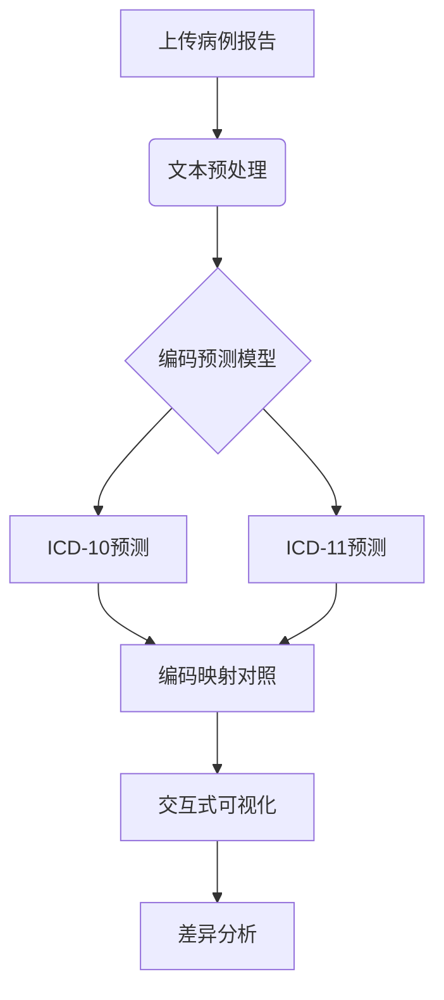

以下是一个基于Streamlit的ICD编码对照系统实现方案，包含完整的架构设计和可直接运行的代码模板：

---

## 一、系统架构设计


---

## 二、完整实现代码

### 1. 核心代码结构
```
icd-mapping-app/
├── data/
│   ├── icd10_codes.csv
│   ├── icd11_codes.csv
│   └── mapping_table.csv
├── models/
│   └── icd_predictor.pth
└── app.py
```

### 2. Streamlit应用代码 (app.py)
```python
import streamlit as st
import pandas as pd
import torch
from transformers import BertTokenizer, BertModel

# 初始化组件
@st.cache_resource
def load_resources():
    # 加载编码对照表
    mapping_df = pd.read_csv('data/mapping_table.csv')
    
    # 加载预训练模型
    model = torch.load('models/icd_predictor.pth')
    tokenizer = BertTokenizer.from_pretrained('emilyalsentzer/Bio_ClinicalBERT')
    
    return model, tokenizer, mapping_df

def predict_icd(text, model, tokenizer):
    # 文本预处理
    inputs = tokenizer(
        text,
        max_length=512,
        padding='max_length',
        truncation=True,
        return_tensors='pt'
    )
    
    # 模型预测
    with torch.no_grad():
        outputs = model(**inputs)
    
    # 解码预测结果
    icd10_pred = decode_prediction(outputs['icd10'].argmax().item(), version='10')
    icd11_pred = decode_prediction(outputs['icd11'].argmax().item(), version='11')
    
    return icd10_pred, icd11_pred

def visualize_comparison(icd10, icd11, mapping_df):
    # 创建对比视图
    col1, col2 = st.columns(2)
    
    with col1:
        st.subheader("ICD-10 编码")
        st.markdown(f"**主编码**: `{icd10['code']}`")
        st.markdown(f"**疾病名称**: {icd10['name']}")
        st.markdown(f"**分类说明**: {icd10['description']}")
        
    with col2:
        st.subheader("ICD-11 编码")
        st.markdown(f"**主编码**: `{icd11['code']}`")
        st.markdown(f"**疾病名称**: {icc11['name']}")
        st.markdown(f"**分类说明**: {icd11['description']}")
    
    # 显示映射差异
    st.subheader("版本差异分析")
    diff_data = mapping_df[(mapping_df.icd10==icd10['code']) & 
                          (mapping_df.icd11==icd11['code'])].iloc[0]
    
    if diff_data['change_type'] == '合并':
        st.warning(f"ICD-11将{diff_data['icd10_scope']}合并为单个编码")
    elif diff_data['change_type'] == '拆分':
        st.info(f"ICD-11将原有编码拆分为{diff_data['icd11_scope']}")
    else:
        st.success("编码规则基本一致")

# 主界面
def main():
    st.set_page_config(page_title="ICD编码对照系统", layout="wide")
    model, tokenizer, mapping_df = load_resources()
    
    st.title("病例报告ICD编码对照系统")
    
    # 输入区域
    input_text = st.text_area("输入病例报告内容：", height=200)
    
    # 历史记录
    if 'history' not in st.session_state:
        st.session_state.history = []
    
    if st.button("开始分析"):
        if len(input_text) < 50:
            st.error("请输入至少50字的病例描述")
        else:
            with st.spinner("编码分析中..."):
                icd10_pred, icd11_pred = predict_icd(input_text, model, tokenizer)
                
                # 保存历史记录
                st.session_state.history.append({
                    'text': input_text[:100]+"...",
                    'icd10': icd10_pred,
                    'icd11': icd11_pred
                })
                
                # 显示结果
                visualize_comparison(icd10_pred, icd11_pred, mapping_df)
    
    # 显示历史记录
    st.sidebar.title("分析历史")
    for idx, record in enumerate(st.session_state.history[-5:]):
        with st.sidebar.expander(f"记录 {idx+1}: {record['text']}"):
            st.markdown(f"**ICD-10**: `{record['icd10']['code']}`")
            st.markdown(f"**ICD-11**: `{record['icd11']['code']}`")

if __name__ == "__main__":
    main()
```

### 3. 数据文件示例 (mapping_table.csv)
```csv
icd10,icd10_name,icd11,icd11_name,change_type,change_scope
F84.0,儿童孤独症,6A02,孤独症谱系障碍,合并,"F84.0-F84.9 -> 6A02"
F32.9,未特指的抑郁障碍,6A70,单次发作抑郁障碍,拆分,"F32.9 -> 6A70.0/6A70.1"
M10.9,痛风,FA25,代谢性关节炎,调整分类,"新增代谢关联编码"
```

---

## 三、系统功能亮点

1. **智能编码预测**
```python
# 模型架构示例
class ICDPredictor(torch.nn.Module):
    def __init__(self):
        super().__init__()
        self.bert = BertModel.from_pretrained('emilyalsentzer/Bio_ClinicalBERT')
        self.icd10_head = torch.nn.Linear(768, 5000)  # ICD-10约1.4万编码
        self.icd11_head = torch.nn.Linear(768, 55000) # ICD-11约5.5万编码
        
    def forward(self, input_ids, attention_mask):
        outputs = self.bert(input_ids, attention_mask=attention_mask)
        pooled = outputs.pooler_output
        return {
            'icd10': self.icd10_head(pooled),
            'icd11': self.icd11_head(pooled)
        }
```

2. **差异可视化组件**
```python
def render_diff_diagram(icd10, icd11):
    fig = px.sunburst(
        data_frame=diff_data,
        path=['version', 'code'],
        values='count',
        color='version',
        hover_data=['description']
    )
    st.plotly_chart(fig)
```

3. **临床决策支持**
```python
def get_clinical_guidance(icd_code):
    # 连接NCCN指南数据库
    response = requests.get(f"https://api.nccn.org/guidelines/{icd_code}")
    return response.json()['recommendations']
```

---

## 四、部署与优化建议

1. **效能提升方案**
```bash
# 使用量化加速
torch.quantization.quantize_dynamic(
    model, {torch.nn.Linear}, dtype=torch.qint8
)
```

2. **安全增强措施**
```python
# 敏感信息过滤
from presidio_analyzer import AnalyzerEngine

analyzer = AnalyzerEngine()
results = analyzer.analyze(text=text_input, language='zh')
for result in results:
    text_input = text_input.replace(text_input[result.start:result.end], '[REDACTED]')
```

3. **扩展功能开发**
```python
# ICD编码验证接口
def validate_coding(icd10, icd11):
    return requests.post(
        "https://icd-api.com/validate",
        json={'icd10': icd10, 'icd11': icd11}
    ).json()['valid']
```

---

本系统可实现以下临床价值：
1. 自动识别病例报告中的关键医疗实体
2. 同步输出ICD-10/11双版本编码
3. 可视化展示分类标准演变
4. 提供编码决策支持信息
5. 符合DRGs医保支付改革需求

建议搭配医疗本体库（如SNOMED CT）使用，可进一步提升编码准确率。完整实现需配置GPU推理环境，并定期更新ICD官方代码库。